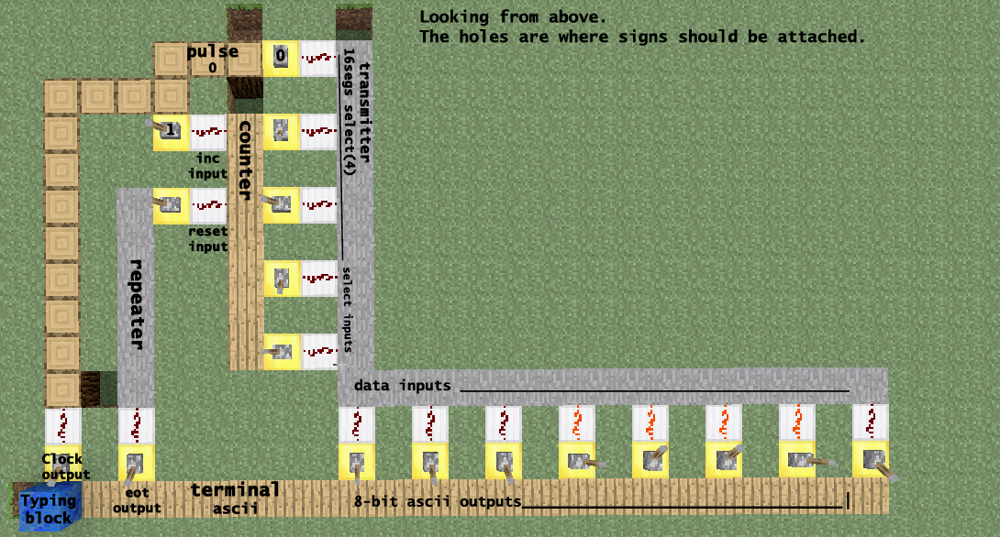
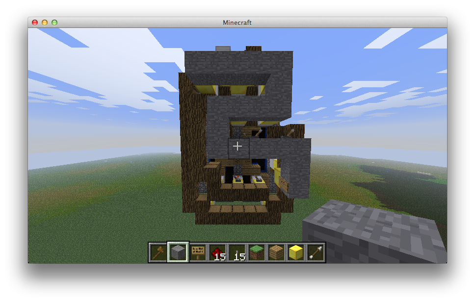
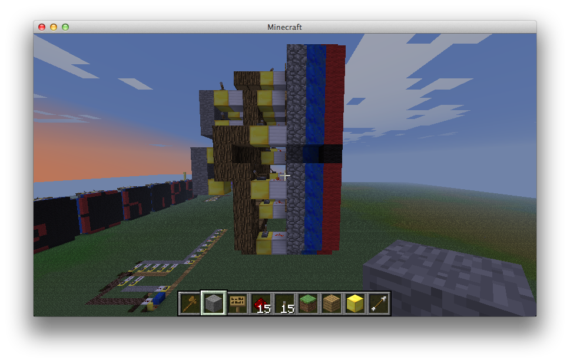
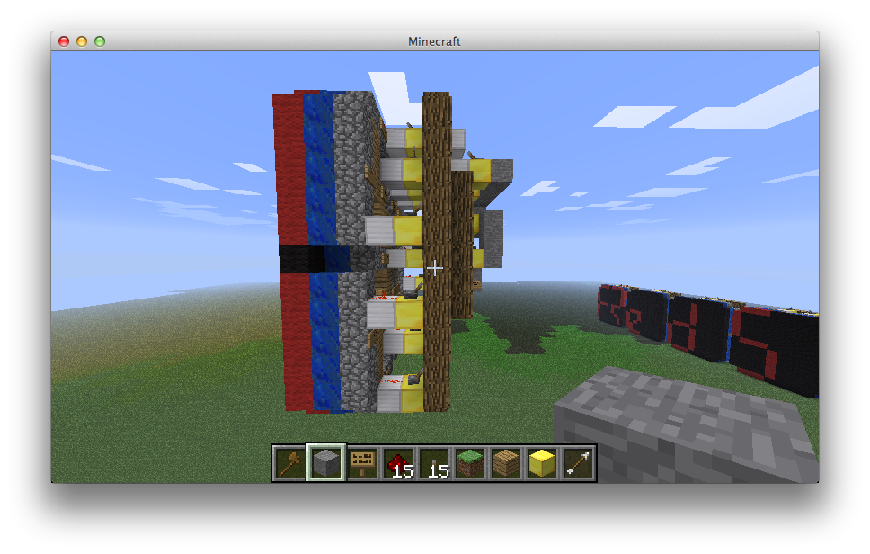
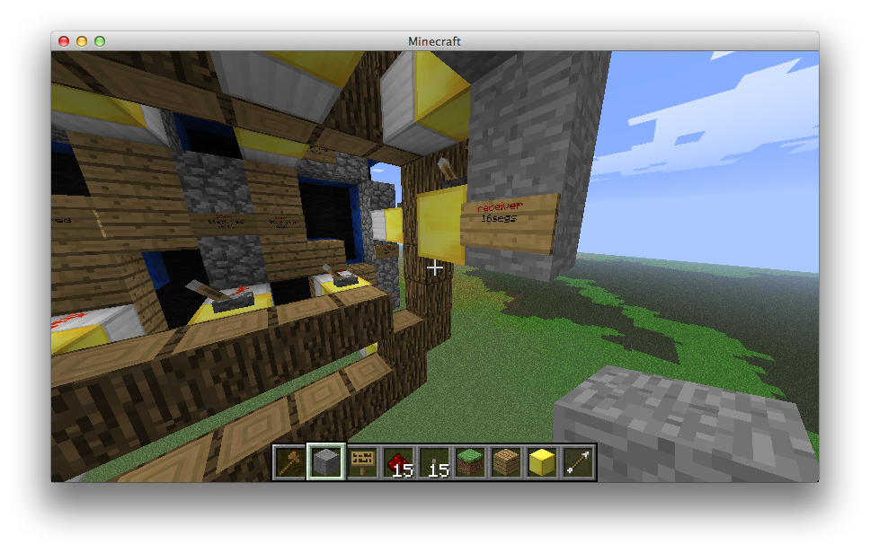

A 16-segment alpha-numeric wool display. Made of 16 [pixel](../circuitdocs/Pixel.html) chips, an [sram](../circuitdocs/Sram.html) and a [receiver](../circuitdocs/Receiver.html).

Send an 8-bit ascii code over the receiver channel in order to set the display. All displayable ascii characters (33-126) are programmed into the sram memory.
You should probably change the receiver channel to something more original than "16segs".

###[Download .schematic](16segdigit.zip)

* * *

Here's a simple circuit for sending character strings from a [terminal](/circuitdocs/Terminal.html) chip.
Paste any number of 16-seg letters and set all of them to use the same receiver channel. Each letter takes up 8 channel bits so each letter's
channel start bit should be greater by 8 than the letter before it. That is, if your channel name is "16segs", 1st letter should receive on 16segs:0, and the next should 16segs:8, 16segs:16, 16segs:24, 16segs:32 etc. To send a message, point at the typing block and enter /rctype `message`

If you need more than 16 letters add select inputs to the transmitter, and outputs to the counter.

* * *

